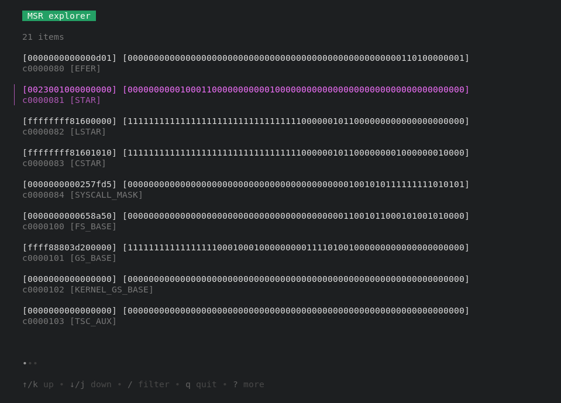

# u-apps - a collection of CLI/TUI apps to explore platforms and systems

Those apps are written in [Go](https://go.dev) and made with the awesome 🧋👄
libraries from [Charm](https://charm.sh). Thank you Charm folks and kudos!

## msrexplore

**DRAFT**

This app shows you MSRs on x86 platforms in an overview. There are lots of them,
so visualization requires many considerations, such as grouping, specific
representation, etc.. We may add more specific semantics on each MSR, which just
means a lot of work. Enjoy!

